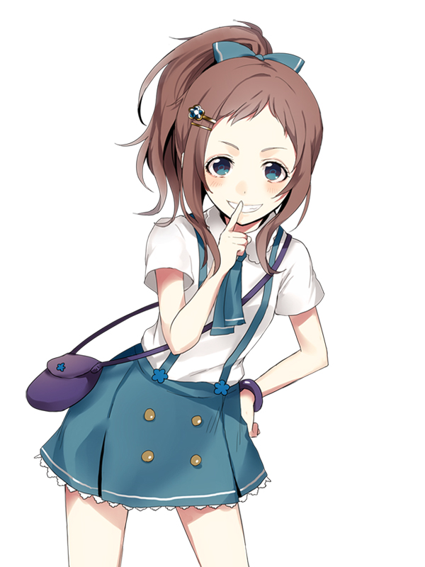
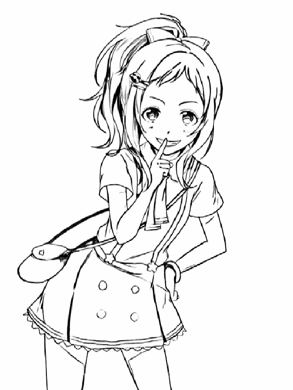
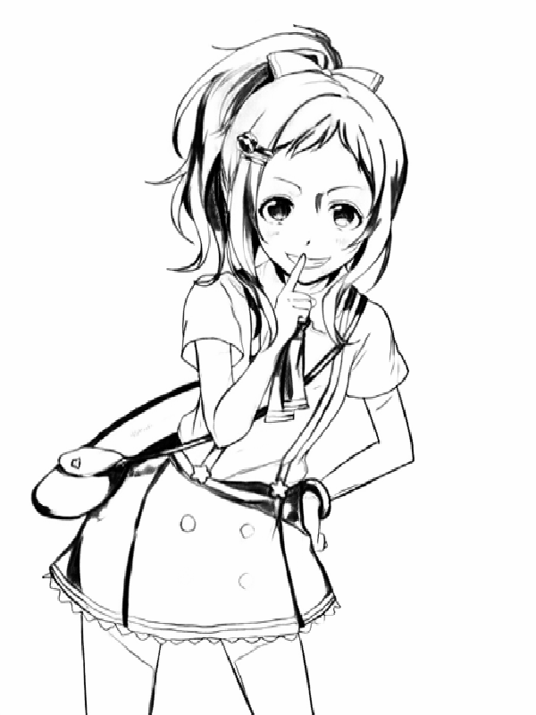
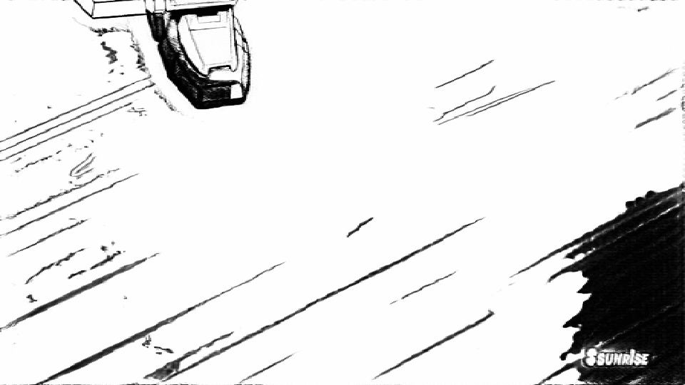
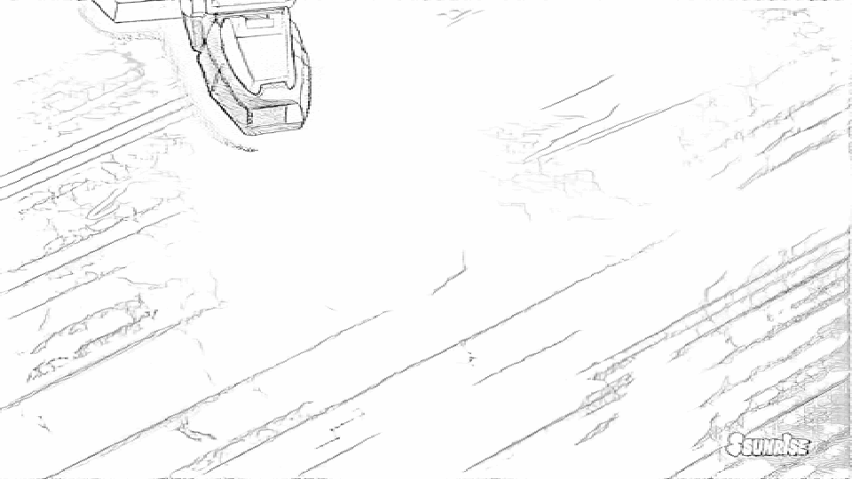

## Semi-supervised Reference based sketch extraction using a contrastive learning framework [SIGGRAPH 2023]

This is official implementation of the paper **"Semi-supervised Reference based sketch extraction using a contrastive learning framework"**

**Chang Wook Seo**, Amirsaman Ashtari, Junyong Noh

Journal: ACM TOG\
Conference: SIGGRAPH 2023\
Project page: https://chanuku.github.io/Semi_ref2sketch/

        
## Train
    $ python train.py --name [model_name] \
                     --model unpaired \
                     --dataroot ./datasets/[datafoler_name] \

* Download the pretrained model from google drive to train and test the model (pre-trained weights for HED and contrastive learning). After download, unzip to the checkpoints folder.
https://drive.google.com/file/d/1YbddMxgIO57gSwTvYxt-C4QraM2AAgVW/view?usp=sharing
* You can change the other settings such as gpu_ids, epochs and etc by adding the arguments. Check **base_options.py** and **train_options.py** in options folder. 
* To understand hierarchy of dataset, see **Dataset directories structure** below. 

## Test
    $ python test_dir.py --name semi_unpair \
                     --model unpaired \
                     --epoch 100 \
                     --dataroot ./datasets/ref_unpair \
## Output examples

Test images are from 4SKST dataset and @GundamInfo official youtube channel

## Dataset
* We released the new sketch dataset which paired to color images. Please check from URL.
https://github.com/Chanuku/4skst

## Dataset directories structure
    |   \---[dataroot]
    |       +---testA
    |       |       +---test_color1.png
    |       |       +---test_color2.png
    |       +---testB
    |       |       +---test_groundtruth1.png #not necessary for testing
    |       |       +---test_groundtruth2.png #not necessary for testing
    |       +---testC
    |       |       +---stylesketch1.png
    |       |       +---stylesketch2.png
    |       +---trainA
    |       |       +---train_color1.png
    |       |       +---train_color2.png
    |       +---trainB
    |       |       +---train_sketch1.png
    |       |       +---train_sketch2.png
    
    #dataset doesn't have to be paired, model can be trained with unpaired dataset
